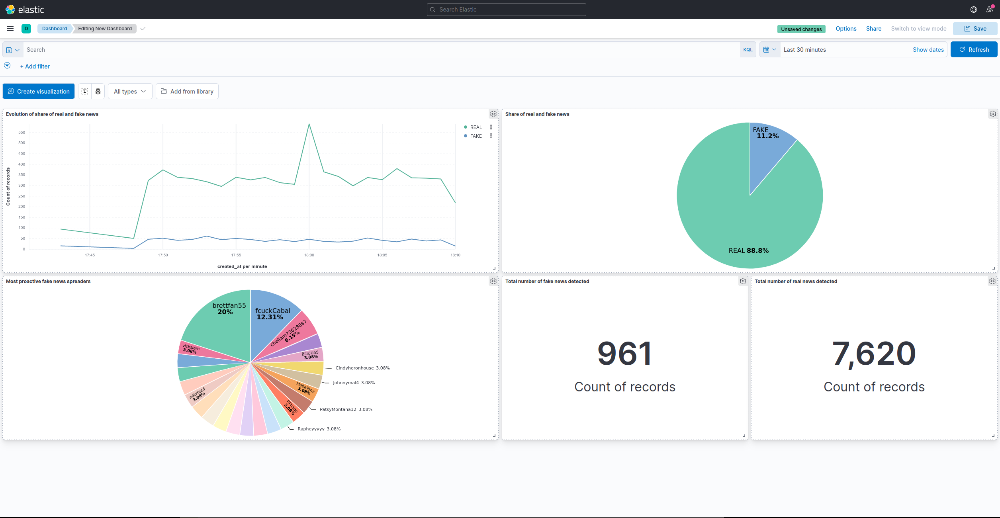

# Fake News Detection




## Install
A Hadoop cluster with Spark 2.4.8 and Python 3.6 is required. This guide assumes that the Hadoop cluster is installed and properly configured.

```sh
$ sudo apt install software-properties-common  # To install command 'add-apt-repository'
$ sudo add-apt-repository ppa:deadsnakes/ppa  # To get python3.6 on Ubuntu 20.04
$ sudo apt update
$ sudo apt install python3.6
```

And edit ~/.bashrc to add:
```sh
export PYSPARK_PYTHON=python3.6
export PYSPARK_DRIVER_PYTHON=python3.6
```

Make sure to place the following files on HDFS:
- `production_model_3/`
- `raw_data_sample.json`

```sh
$ cd models/
$ hdfs dfs -put production_model_3
$ cd ..
$ hdfs dfs -put raw_data_sample.json
```

Install the required dependencies:
```
python3.6 -m pip install -r requirements.text
```

Set the SPARK_HOME environment variable to the correct path in `run.sh`:
```sh
export SPARK_HOME=/home/huser/spark248  # Replace with actual Spark 2.4.8 path
```

## Running
Starting ElasticSearch and Kibana if they are not running:
```
sudo systemctl start elasticsearch.service
sudo systemctl start kibana.service
```

Start the Kafka daemon if not already running:
```
../kafka/bin/kafka-server-start.sh -daemon ../kafka/conf/server.properties
```

Start Kafka Connect if not already running:
```
../kafka/bin/connect-standalone.sh ../kafka/config/connect-standalone.properties
```

Run the program:
```
./run.sh
```

## Adding a custom producer
Custom producers can be added to get data from other data sources. Default producers include `twitter` and `reddit_comments`.
To add a new producer, add a module in `producers/`. This module must define a class that inherits from `stream_producer.KafkaSourceStream` and define the following methods:
- `start_stream(self)` that activates the stream. This method must start the stream and return immediately, it must not block.
- `stop_stream(self)` that stops the stream.
The data from the stream must be properly formatted pushed into Kafka using the method `KafkaSourceStream.send(self, data)`
Here is an example of formatted data:
```json
{"source":"twitter", "type": "tweet", "tweet_id": "123", "author_id":"123", "author_username":"matthias", "author_name":"Matthias", "text":"The text of the element", "location": [-75.14310264, 40.05701649], "created_at":"2021-08-03T13:23:22.000Z"}
```

## Changing the prediction model
Changing the prediction model can be done by replacing the `models/production_model_3` directory (or adding a new directory and changing the code in `prediction_engine.py`). The directory must be created by saving a Spark ML model. This model must take a datafram column `text` as input and perform a binary classification (the output columns must therefore include `prediction` and `probability`). Any columns created by the internal stages of the model will be included in the output data, which can be undesirable.

## Important notes
- The retention_ms config option of the `postprocessed_predictions` Kfaka topic is set to 60000 (60 seconds) to make development easy by preventing issues in the case where badly formatted data is pushed into the topic. If this retention time is too short and causes problem, it can be changed.
- The quality of the predictions has not been evaluated on real time data.
- The current model (`production_model_3`) has only been trained on Twitter data. The Reddit producer has been included to show that the platform is easily extensible with new producers, but the predictions made on reddit data cannot be trusted.
## Todo
- Fix the streaming queries not closed properly
- Add the tweet id as key in Kafka records.
